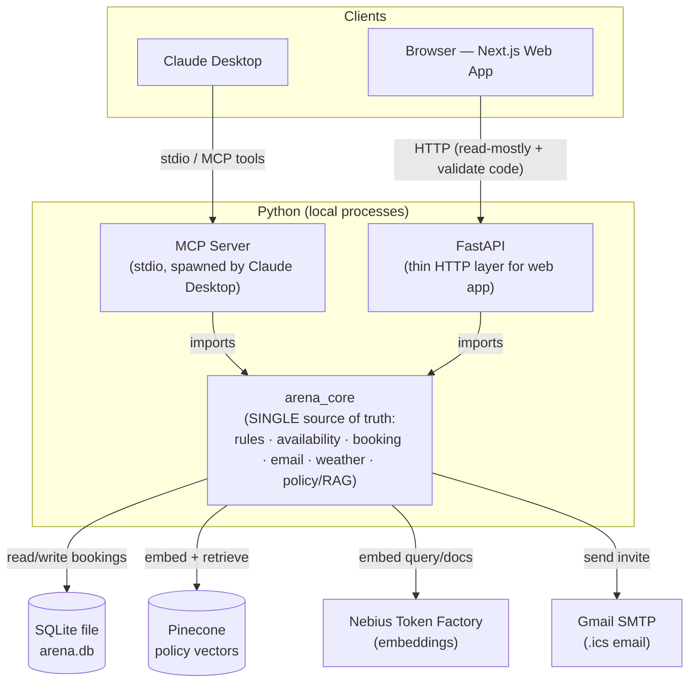

# VirtualSoccerArena — Implementation Plan

> A local, Claude-Desktop-driven booking demo for a fictional indoor soccer arena.
> Claude books sessions through an **MCP server**; a separate **Next.js web app** shows
> info and hosts a code-locked mini-game. Both sit on **one shared Python core + one SQLite file**.

This document is the build spec. It captures every decision made during planning, the
architecture, the data model, the business rules, each component's responsibilities, the
setup/README content, the build order, and the known gotchas. Code blocks are *illustrative*
and commented for learning — pin exact library versions and verify SDK APIs against current
docs as you implement.

---

## 1. Project Description

VirtualSoccerArena is a learning project (cohort) that demonstrates the **Model Context
Protocol (MCP)**. The headline demo: inside **Claude Desktop**, you ask Claude to check
availability, read a policy, check the weather, and book a 2-hour session. Claude calls your
local MCP tools, and a booking lands in a SQLite database with a unique code. You then open
the **web app**, enter that code, and a doodle-soccer mini-game unlocks — proving Claude and
the web app share one source of truth.

### Four features

1. **Policy check** — RAG over a ~100-page policy PDF (cancellation, rebooking, late arrival, etc.). LlamaIndex retrieves the relevant passages; **Claude** synthesizes the answer.
2. **Availability & rates** — computed from rules (open hours, peak/off-peak, weekend uplift, Ontario holiday closures), minus already-booked slots.
3. **Booking & confirmation** — returns a unique code and emails an `.ics` calendar invite.
4. **Weather forecast** — mock seasonal data for the demo window (Jun–Dec 2026).

### Key principle: one brain, two front doors

All business logic lives once in a Python package, **`arena_core`**. It is consumed by two
"front doors": the **MCP server** (for Claude) and a thin **FastAPI** layer (for the web app).
**Availability is never stored — it is computed.** Bookings in SQLite are the single source of
truth; availability is just a query over them plus the rules.

---

## 2. Architecture



**Why this shape**

- The **MCP server imports `arena_core` directly** (same process) — no extra always-on backend is needed for Claude to book.
- **FastAPI imports `arena_core` too** — the web app reaches the same logic over HTTP without re-implementing anything in TypeScript.
- Both Python processes **open the same SQLite file**, so a booking made by Claude is instantly visible to the web app. (Enable WAL mode for safe concurrent read/write — see §11.)
- **No availability math is written twice.** The web app and the MCP server both call the same functions.

---

## 3. Tech Stack & External Services

| Layer | Choice | Notes |
|---|---|---|
| Core logic | **Python 3.11+** | `arena_core` package |
| MCP server | **MCP Python SDK (FastMCP)** | stdio transport; verify SDK version |
| Web API | **FastAPI + Uvicorn** | thin, read-mostly |
| Web app | **Next.js (App Router) + TypeScript + Tailwind + shadcn/ui** | modern UI, the mini-game |
| Database | **SQLite** | single shared file; bookings are source of truth |
| RAG framework | **LlamaIndex** (retriever only) | parse → chunk → embed → store → retrieve |
| Embeddings | **OpenAI** (`text-embedding-3-small`, 1536-dim) | needs `OPENAI_API_KEY`; dim must match Pinecone index |
| Vector store | **Pinecone** | index **dimension must match** the embed model |
| Email | **Gmail SMTP** | needs a Gmail **App Password** (2FA required) |
| Calendar | `.ics` file (`icalendar` or `ics` lib) | attached to the email |
| MCP client | **Claude Desktop** | local stdio servers only work in the desktop app |

**External accounts/keys required:** Nebius (embeddings), Pinecone (vector store), a Gmail
account with an App Password. Claude Desktop installed locally.

---

## 4. Repository Structure

```
virtualsoccerarena/
├── README.md                       # = §10 of this plan (setup + description)
├── .env.example                    # all required env vars (no secrets committed)
├── .gitignore
│
├── backend/                        # All Python
│   ├── requirements.txt
│   ├── arena_core/                 # ⭐ single source of truth
│   │   ├── __init__.py
│   │   ├── config.py               # load env, settings (DB path, keys, hours)
│   │   ├── db.py                   # SQLite connect + schema init (+ WAL pragma)
│   │   ├── models.py               # typed models (pydantic/dataclasses)
│   │   ├── rules.py                # hours, sessions, peak/off-peak, rates, holidays
│   │   ├── availability.py         # compute open slots for a date
│   │   ├── booking.py              # create/get/cancel/rebook + unique-code gen
│   │   ├── email_service.py        # build .ics + send via Gmail SMTP
│   │   ├── weather.py              # deterministic mock forecast
│   │   └── policy/
│   │       ├── __init__.py
│   │       ├── ingest.py           # parse PDF → chunk → embed → upsert to Pinecone
│   │       └── retriever.py        # question → top-k policy passages
│   │
│   ├── mcp_server/
│   │   └── server.py               # FastMCP app exposing the 4 core tools
│   │
│   ├── api/
│   │   └── main.py                 # FastAPI: reads + validate-code endpoint
│   │
│   ├── scripts/
│   │   ├── seed_policies.md        # ~15–25 real, distinct policy sections (the seed)
│   │   ├── generate_policy_pdf.py  # Step 0: inflate seed → ~100-page PDF
│   │   └── init_db.py              # create tables / reset DB
│   │
│   └── tests/                      # pytest: rules, availability, booking, codes
│
├── web/                            # Next.js + TS + Tailwind + shadcn/ui
│   ├── package.json
│   ├── app/
│   │   ├── page.tsx                # Home: availability & rates viewer
│   │   ├── policies/page.tsx       # Policy viewer (read-only)
│   │   ├── weather/page.tsx        # Weather viewer
│   │   └── play/page.tsx           # Doodle game (code-locked)
│   ├── components/                 # UI components (shadcn-based)
│   └── lib/api.ts                  # typed fetch wrappers → FastAPI
│
└── docs/
    └── claude_desktop_config.example.json
```

---

## 5. Data Model (SQLite)

Single table. Bookings are the source of truth; availability is derived from it.

```sql
-- backend/arena_core/db.py runs this on startup

CREATE TABLE IF NOT EXISTS bookings (
    id            INTEGER PRIMARY KEY AUTOINCREMENT,
    code          TEXT    NOT NULL UNIQUE,           -- e.g. "ARENA-7F3K"; unlocks the game
    name          TEXT    NOT NULL,
    email         TEXT    NOT NULL,
    booking_date  TEXT    NOT NULL,                  -- ISO date "YYYY-MM-DD"
    start_time    TEXT    NOT NULL,                  -- "HH:MM" 24h; start of a 2-hour slot
    rate_cad      REAL    NOT NULL,                  -- price charged for this slot
    status        TEXT    NOT NULL DEFAULT 'confirmed', -- 'confirmed' | 'cancelled'
    created_at    TEXT    NOT NULL                   -- ISO timestamp
);

-- ⭐ Prevent double-booking: only ONE *confirmed* booking per (date, slot).
-- A partial unique index lets a cancelled row and a new confirmed row coexist
-- for the same slot (needed for rebooking), while blocking two active bookings.
CREATE UNIQUE INDEX IF NOT EXISTS uq_active_slot
    ON bookings (booking_date, start_time)
    WHERE status = 'confirmed';
```

---

## 6. Business Rules (`rules.py`)

These are demo values, fixed in code (no admin UI).

### Open hours & sessions (2-hour slots)

| Day type | Hours | Sessions (start times) |
|---|---|---|
| **Weekday** (Mon–Fri) | 08:00–20:00 | 08:00, 10:00, 12:00, 14:00, 16:00, 18:00 (6) |
| **Weekend** (Sat–Sun) | 06:00–22:00 | 06:00, 08:00, 10:00, 12:00, 14:00, 16:00, 18:00, 20:00 (8) |

### Peak vs off-peak

- **Weekday peak:** 16:00 and 18:00 sessions (after-work). Everything else off-peak.
- **Weekend peak:** 10:00, 12:00, 14:00, 16:00 (the midday block). Early morning & evening off-peak.

### Rates (CAD per 2-hour session)

| | Off-peak | Peak |
|---|---|---|
| **Weekday** | $120 | $160 |
| **Weekend** | $150 | $200 |

Satisfies: off-peak < peak, and weekend > weekday at every tier.

### Holiday closures — Ontario, Jun–Dec 2026 (arena fully closed)

| Holiday | Date |
|---|---|
| Canada Day | Wed, Jul 1, 2026 |
| August Civic Holiday | Mon, Aug 3, 2026 |
| Labour Day | Mon, Sep 7, 2026 |
| Thanksgiving | Mon, Oct 12, 2026 |
| Remembrance Day | Wed, Nov 11, 2026 |
| Christmas Day | Fri, Dec 25, 2026 |
| Boxing Day | Sat, Dec 26, 2026 |

```python
# backend/arena_core/rules.py  (illustrative)
from datetime import date

WEEKDAY_SESSIONS = ["08:00", "10:00", "12:00", "14:00", "16:00", "18:00"]
WEEKEND_SESSIONS = ["06:00", "08:00", "10:00", "12:00", "14:00", "16:00", "18:00", "20:00"]

WEEKDAY_PEAK = {"16:00", "18:00"}
WEEKEND_PEAK = {"10:00", "12:00", "14:00", "16:00"}

RATES = {  # (day_type, tier) -> CAD
    ("weekday", "offpeak"): 120, ("weekday", "peak"): 160,
    ("weekend", "offpeak"): 150, ("weekend", "peak"): 200,
}

# Arena closed all day on these dates (Ontario, demo window)
HOLIDAYS = {
    date(2026, 7, 1), date(2026, 8, 3), date(2026, 9, 7),
    date(2026, 10, 12), date(2026, 11, 11), date(2026, 12, 25), date(2026, 12, 26),
}

def day_type(d: date) -> str:
    return "weekend" if d.weekday() >= 5 else "weekday"  # 5=Sat, 6=Sun

def is_peak(d: date, start_time: str) -> bool:
    peak = WEEKDAY_PEAK if day_type(d) == "weekday" else WEEKEND_PEAK
    return start_time in peak

def rate_for(d: date, start_time: str) -> int:
    dt = day_type(d)
    tier = "peak" if is_peak(d, start_time) else "offpeak"
    return RATES[(dt, tier)]
```

---

## 7. Feature Implementations

### 7.1 Availability & Rates (`availability.py`)

```python
# Availability = (all sessions for the day's rules) minus (confirmed bookings).
# Returns closed=True on holidays. Nothing about availability is persisted.
def get_availability(date_str: str) -> dict:
    d = parse_iso_date(date_str)                       # "YYYY-MM-DD" -> date
    if d in rules.HOLIDAYS:
        return {"date": date_str, "closed": True, "reason": "Holiday closure", "slots": []}

    dt = rules.day_type(d)
    sessions = rules.WEEKDAY_SESSIONS if dt == "weekday" else rules.WEEKEND_SESSIONS
    taken = db.confirmed_start_times(date_str)          # set of booked "HH:MM"

    slots = [
        {
            "start_time": s,
            "end_time": add_hours(s, 2),
            "tier": "peak" if rules.is_peak(d, s) else "offpeak",
            "rate_cad": rules.rate_for(d, s),
            "available": s not in taken,
        }
        for s in sessions
    ]
    return {"date": date_str, "closed": False, "day_type": dt, "slots": slots}
```

### 7.2 Booking & Confirmation (`booking.py` + `email_service.py`)

```python
import secrets

# Avoid ambiguous chars (no 0/O/1/I) so codes are easy to read from email/chat.
_ALPHABET = "ABCDEFGHJKMNPQRSTUVWXYZ23456789"

def _new_code() -> str:
    return "ARENA-" + "".join(secrets.choice(_ALPHABET) for _ in range(4))  # e.g. ARENA-7F3K

def create(name: str, email: str, date_str: str, start_time: str) -> dict:
    # 1) Validate against rules (open day, valid session, not a holiday).
    _validate_slot(date_str, start_time)
    # 2) Insert. The partial unique index throws if the slot is already confirmed.
    #    Catch that and return a friendly "slot taken" error to Claude.
    rate = rules.rate_for(parse_iso_date(date_str), start_time)
    code = _insert_with_unique_code(name, email, date_str, start_time, rate)
    # 3) Build .ics and email it via Gmail SMTP (failure here is logged, not fatal to booking).
    email_service.send_invite(name, email, date_str, start_time, code, rate)
    # 4) Return the code so Claude can show it in chat.
    return {"code": code, "date": date_str, "start_time": start_time,
            "end_time": add_hours(start_time, 2), "rate_cad": rate,
            "message": f"Sent a calendar invite with booking code {code} to {email}."}
```

```python
# email_service.py — build a VEVENT and send through Gmail SMTP (STARTTLS, port 587).
# Requires a Gmail App Password (NOT the normal account password). See §11.
def send_invite(name, email, date_str, start_time, code, rate):
    ics_bytes = _build_ics(date_str, start_time, code)      # icalendar VEVENT, 2h duration
    msg = MIMEMultipart()
    msg["Subject"] = f"VirtualSoccerArena booking {code}"
    msg["From"], msg["To"] = config.GMAIL_ADDRESS, email
    msg.attach(MIMEText(f"Hi {name}, your slot is confirmed. Code: {code} (${rate})."))
    _attach_ics(msg, ics_bytes)
    with smtplib.SMTP("smtp.gmail.com", 587) as s:
        s.starttls()
        s.login(config.GMAIL_ADDRESS, config.GMAIL_APP_PASSWORD)
        s.send_message(msg)
```

### 7.3 Weather (`weather.py`)

Deterministic mock — same date always returns the same forecast (seed on the date), so the
demo is repeatable. Seasonal across the window: warm/sunny in summer → cool/overcast in fall →
cold/snow by December.

```python
def forecast(date_str: str) -> dict:
    d = parse_iso_date(date_str)
    rng = random.Random(d.toordinal())                 # stable per-date seed
    month = d.month
    if month in (6, 7, 8):   temp, conds = rng.randint(20, 31), ["sunny", "sunny", "overcast"]
    elif month in (9, 10):   temp, conds = rng.randint(8, 18),  ["overcast", "rainy", "sunny"]
    else:                    temp, conds = rng.randint(-12, 2), ["snow", "overcast", "snow"]
    return {"date": date_str, "temp_c": temp, "condition": rng.choice(conds)}
```

### 7.4 Policy Check — RAG (`policy/ingest.py` + `policy/retriever.py`)

LlamaIndex is used as a **retriever only**. Claude does the synthesis, so there is **no LLM in
the pipeline** — no LLM key needed. Embeddings come from Nebius (OpenAI-compatible), vectors
live in Pinecone.

```python
# ingest.py — run ONCE (or when policies change) to populate Pinecone.
# parse PDF -> chunk -> embed (Nebius) -> upsert (Pinecone)
def ingest(pdf_path: str):
    docs = SimpleDirectoryReader(input_files=[pdf_path]).load_data()   # local pypdf parse
    splitter = SentenceSplitter(chunk_size=512, chunk_overlap=64)
    embed = OpenAIEmbedding(                                           # OpenAI-compatible client
        api_base=config.NEBIUS_API_BASE,                              # Nebius endpoint
        api_key=config.NEBIUS_API_KEY,
        model_name=config.NEBIUS_EMBED_MODEL,
    )
    vector_store = PineconeVectorStore(pinecone_index=_get_index())    # dim must match model!
    storage = StorageContext.from_defaults(vector_store=vector_store)
    VectorStoreIndex.from_documents(
        docs, transformations=[splitter], embed_model=embed, storage_context=storage,
    )
```

```python
# retriever.py — query time: embed question, fetch top-k passages, return their text.
def query(question: str, top_k: int = 4) -> str:
    index = VectorStoreIndex.from_vector_store(_pinecone_store(), embed_model=_embed())
    nodes = index.as_retriever(similarity_top_k=top_k).retrieve(question)
    # Return raw passages; Claude turns them into the final answer.
    return "\n\n---\n\n".join(n.get_content() for n in nodes)
```

> ⚠️ **Dimension match:** create the Pinecone index with the *exact* output dimension of your
> chosen Nebius embedding model. Mismatch is the #1 first-day RAG bug.

---

## 8. MCP Tools (the Claude-facing surface)

Four core tools. Tool **docstrings are the design surface** — they are all Claude sees to
decide when/how to call. Write them precisely.

```python
# backend/mcp_server/server.py
from mcp.server.fastmcp import FastMCP
from arena_core import availability, booking, weather
from arena_core.policy import retriever

mcp = FastMCP("VirtualSoccerArena")

@mcp.tool()
def check_availability(date: str) -> dict:
    """List open 2-hour slots and their CAD rates for a date (format 'YYYY-MM-DD').
    Returns closed=True with a reason on Ontario holidays. Use before booking to see
    what's open and how much each slot costs."""
    return availability.get_availability(date)

@mcp.tool()
def query_policy(question: str) -> str:
    """Look up arena policy (cancellation, rebooking, late arrival, refunds, conduct, etc.).
    Pass the user's question; returns the most relevant policy passages. Base your answer
    on the returned text rather than prior assumptions."""
    return retriever.query(question)

@mcp.tool()
def create_booking(name: str, email: str, date: str, start_time: str) -> dict:
    """Book a 2-hour session. 'date' is 'YYYY-MM-DD'; 'start_time' is 'HH:MM' 24-hour and must
    be a valid session start. Returns a unique booking code and emails an .ics invite. Fails if
    the slot is already taken or the arena is closed that day."""
    return booking.create(name, email, date, start_time)

@mcp.tool()
def get_weather(date: str) -> dict:
    """Mock weather forecast (temperature in °C + condition) for a date ('YYYY-MM-DD') within
    the Jun–Dec 2026 demo window."""
    return weather.forecast(date)

if __name__ == "__main__":
    mcp.run(transport="stdio")   # Claude Desktop launches this and talks over stdio
```

### Phase 2 (optional) tools — keep in plan, build later

- `get_booking(code)` → look up a booking by its code.
- `cancel_booking(code)` → set status='cancelled' (frees the slot).
- `rebook(code, new_date, new_start_time)` → cancel + create in one call.

These are purely additive (they operate on existing rows) and don't touch the core demo.

---

## 9. Web App (`web/`)

Scope: **read-mostly + the mini-game** (all booking happens through Claude). Next.js App Router,
Tailwind, shadcn/ui. `lib/api.ts` wraps calls to FastAPI.

| Page | Purpose | Data source |
|---|---|---|
| `/` (Home) | Pick a date → see slots, tiers, rates, open/closed | `GET /availability?date=` |
| `/policies` | Read-only policy viewer (sections or PDF link) | `GET /policies` |
| `/weather` | Forecast for a date | `GET /weather?date=` |
| `/play` | **Doodle soccer mini-game, code-locked** | `POST /validate-code` |

**The mini-game — doodle-style goalkeeper MVP.** Inspired by Google's 2012 soccer doodle. Enter
the booking code → `validateCode()` succeeds → Play button enables → game starts. The unlock
flow is the demo point; the game itself is the reward.

**Scope (MVP, ~3 days):**

- **Loop:** balls fly at the goal from random angles/speeds; player moves the keeper
  left/right and dives to save; 3 misses = game over.
- **Controls:** ← / → / Space on desktop; tap-left / tap-right / swipe-up on touch.
- **Rendering:** HTML `<canvas>` driven by **PixiJS** (lighter than Three.js, sprite-friendly).
- **Assets:** 4–5 keeper sprite states (idle, dive-L, dive-R, jump, catch) + ball sprite +
  goal/field background. Free or AI-generated art is fine for MVP — art polish is the upgrade
  path, not the MVP.
- **Ball physics:** parametric parabola (start point → target point on goal line over N
  frames). No physics engine.
- **Difficulty:** speed ramps with score; angle variance widens every 5 saves.
- **HUD:** score, lives (3), high-score in `localStorage`.
- **Screens:** start ("Press Space to begin"), in-game, game-over ("Play again" / "Back").
- **Audio:** kick, save, miss, crowd loop — short royalty-free SFX.

**Explicitly out of scope for MVP** (defer to a polish phase if desired): hand-drawn animation
frames, ball spin/curve, replay sharing, server-side leaderboard, multiplayer.

**Integration:** stays a single `app/play/page.tsx` client component. No backend changes — the
existing `POST /validate-code` is the only API touchpoint. Optional later: `POST /score` to
persist high scores to SQLite.

```ts
// web/lib/api.ts — typed wrappers around the FastAPI layer
const BASE = process.env.NEXT_PUBLIC_API_URL ?? "http://localhost:8000";
export const getAvailability = (date: string) =>
  fetch(`${BASE}/availability?date=${date}`).then(r => r.json());
export const validateCode = (code: string) =>
  fetch(`${BASE}/validate-code`, {
    method: "POST", headers: { "Content-Type": "application/json" },
    body: JSON.stringify({ code }),
  }).then(r => r.json());   // -> { valid: boolean, booking?: {...} }
```

### FastAPI layer (`api/main.py`)

Thin wrappers over `arena_core`, read-mostly, plus one validate endpoint. Enable CORS for the
Next.js dev origin (`http://localhost:3000`).

```python
app = FastAPI(title="VirtualSoccerArena API")
app.add_middleware(CORSMiddleware, allow_origins=["http://localhost:3000"], allow_methods=["*"])

@app.get("/availability")
def availability_route(date: str):           # read-only
    return availability.get_availability(date)

@app.get("/weather")
def weather_route(date: str):
    return weather.forecast(date)

@app.get("/policies")
def policies_route():                        # serve sections or a static PDF link
    return policy_index.list_sections()

@app.post("/validate-code")                  # game unlock: code -> SQLite lookup
def validate_route(payload: CodeIn):
    bk = booking.get_by_code(payload.code)
    return {"valid": bk is not None and bk["status"] == "confirmed", "booking": bk}
```

---

## 10. Setup / README Content

> This section becomes `README.md`. It contains the project description (use §1) plus the
> setup below.

### Prerequisites

- Python 3.11+ and Node.js 18+
- **Claude Desktop** installed (local MCP servers don't work in the browser)
- A **Nebius Token Factory** account + API key (embeddings)
- A **Pinecone** account + API key
- A **Gmail** account with **2-Step Verification ON** and a generated **App Password**

### Environment variables (`.env.example`)

```bash
# --- Database ---
ARENA_DB_PATH=./arena.db

# --- Embeddings (Nebius Token Factory; OpenAI-compatible) ---
NEBIUS_API_KEY=your_nebius_key
NEBIUS_API_BASE=https://api.studio.nebius.com/v1/   # verify exact base in Nebius console
NEBIUS_EMBED_MODEL=BAAI/bge-...                     # verify exact model id
NEBIUS_EMBED_DIM=1024                               # MUST equal the model's output dim

# --- Vector store ---
PINECONE_API_KEY=your_pinecone_key
PINECONE_INDEX=virtualsoccerarena-policies          # create with dim = NEBIUS_EMBED_DIM

# --- Email (Gmail SMTP) ---
GMAIL_ADDRESS=you@gmail.com
GMAIL_APP_PASSWORD=your_16_char_app_password        # App Password, not your login password
```

### Backend setup

```bash
cd backend
python -m venv .venv && source .venv/bin/activate    # Windows: .venv\Scripts\activate
pip install -r requirements.txt
cp ../.env.example ../.env                            # then fill in real values

python scripts/generate_policy_pdf.py                # Step 0: build the ~100-page policy PDF
python scripts/init_db.py                            # create the SQLite schema
python -m arena_core.policy.ingest policies.pdf      # embed + upsert to Pinecone (run once)
```

### Run the API + web app

```bash
# Terminal 1 — API for the web app
cd backend && uvicorn api.main:app --reload --port 8000

# Terminal 2 — web app
cd web && npm install && npm run dev                 # http://localhost:3000
```

### Wire the MCP server into Claude Desktop

Add to Claude Desktop's config (`docs/claude_desktop_config.example.json`), then **restart
Claude Desktop**:

```json
{
  "mcpServers": {
    "virtualsoccerarena": {
      "command": "/absolute/path/to/backend/.venv/bin/python",
      "args": ["-m", "mcp_server.server"],
      "cwd": "/absolute/path/to/backend"
    }
  }
}
```

> Use the **absolute path to the venv's Python** and set `cwd` to `backend/` so imports and
> `.env` resolve. After editing, fully restart Claude Desktop.

### Run the demo

1. In Claude Desktop: *"What's open at the arena on July 4, 2026?"* → Claude calls `check_availability`.
2. *"What's the cancellation policy?"* → `query_policy`.
3. *"Book the 6pm slot for Alex, alex@example.com."* → `create_booking` → Claude shows the code.
4. Open `http://localhost:3000/play`, enter the code → the mini-game unlocks.

---

## 11. Known Gotchas & Best Practices

- **Gmail App Password:** Gmail rejects your normal password over SMTP. Enable 2-Step Verification, generate a 16-char App Password, use that. Otherwise email silently fails.
- **Pinecone dimension:** the index dimension must equal the Nebius embedding model's output dimension. Set it once, correctly.
- **SQLite + two processes:** enable WAL so the MCP server and FastAPI can read/write concurrently without locking errors: `PRAGMA journal_mode=WAL;` in `db.py` on connect.
- **MCP server path:** in Claude Desktop config, use the absolute venv Python path and a `cwd`; restart the app after any config change.
- **Demo window is Jun–Dec 2026:** weather and rates outside that range are undefined — decide whether to reject or clamp, and document it.
- **Secrets:** never commit `.env`; only `.env.example`. Add `.env`, `arena.db`, `.venv/`, `node_modules/` to `.gitignore`.
- **Idempotent ingest:** re-running `ingest` should not duplicate vectors — namespace or clear the index first.
- **Verify the MCP SDK API:** FastMCP decorators/transport are shown illustratively; pin the SDK version and check current docs before relying on the snippets.

---

## 12. Step 0 — Generate the Policy PDF Cheaply

Don't pay tokens for 100 pages of prose. **Generate a generator.**

1. **Seed (`scripts/seed_policies.md`)** — ~15–25 *genuinely distinct* sections written once: cancellation, rebooking, late arrival, no-shows, refunds, weather closures, code of conduct, equipment rental, group/team bookings, membership tiers, payment, liability waiver, age rules, facility rules, FAQ. A few thousand words. **These are what RAG actually retrieves.**
2. **Inflator (`scripts/generate_policy_pdf.py`)** — assemble the seed + *domain-relevant* filler (rate tables for the Jun–Dec 2026 dates, sample schedules, expanded FAQ, appendices, glossary) and render to PDF via **pandoc** or **weasyprint** (Markdown → PDF, least code).

> Don't pad with plain lorem ipsum — retrieval is only testable if chunks are semantically
> distinct and findable. Make filler domain-flavored so you can write test queries against it.

---

## 13. Build Order (Phases)

| Phase | Deliverable | Proves |
|---|---|---|
| **0** | Scaffold repo, `.env`, generate policy PDF, init DB | foundation ready |
| **1** | `arena_core`: rules, availability, booking, email, weather + **pytest** | logic is correct in isolation |
| **2** | RAG: `ingest` + `retriever` against Pinecone | policy questions return right passages |
| **3** | MCP server + Claude Desktop wiring | **★ book a session through Claude** |
| **4** | FastAPI + Next.js (availability/policy/weather views + code-locked **doodle-MVP** game) | shared-DB demo end-to-end |
| **5 (optional)** | `get_booking` / `cancel_booking` / `rebook` tools (+ web booking form if wanted) | richer Claude actions |
| **6 (optional)** | Game polish: custom art, ball curve, server-side leaderboard via `POST /score` | turns the demo into a portfolio piece |

---

## 14. Testing

- **Unit (pytest):** day-type detection; correct sessions per day type; peak/off-peak classification; rate table; holiday closures (each of the 7 dates returns closed); availability subtracts confirmed bookings; double-booking is rejected by the partial unique index; code generator never collides and uses the safe alphabet.
- **Integration:** `create_booking` writes a row, returns a code, and the same code validates via FastAPI's `/validate-code`.
- **Manual (MCP):** in Claude Desktop, exercise each of the 4 tools and confirm Claude calls them with correct arguments.
- **RAG sanity:** a handful of known questions retrieve the expected policy section.

---

*End of plan. Code blocks are illustrative and commented for learning — verify exact library
APIs (MCP SDK, LlamaIndex, Pinecone client, Nebius model id/dimension) against current docs as
you implement.*
